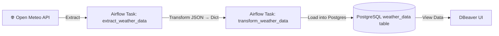

# 🌦 Weather ETL Pipeline with Airflow, Docker & Postgres


🚀 An **ETL pipeline** to fetch live weather data from the [Open Meteo API](https://open-meteo.com/), transform it, and load it into a **PostgreSQL database** using **Apache Airflow** running on **Astro + Docker**.

---

## 📊 Architecture



---

## 🎯 Features

* ✅ Automated daily ETL pipeline with **Airflow**
* ✅ Extracts weather data (temperature, windspeed, direction, weather code)
* ✅ Transforms into structured format
* ✅ Loads into **PostgreSQL** table (`weather_data`)
* ✅ Query, monitor & debug via **DBeaver**
* ✅ Dockerized environment for portability

---

## 🛠️ Tools & Tech Stack

* **Apache Airflow (Astro)** → Orchestrating ETL
* **Docker** → Containerized Postgres + Airflow
* **PostgreSQL** → Weather data storage
* **Python** → ETL scripting
* **DBeaver** → Query and visualization

---

## ⚙️ Setup Guide

### 1️⃣ Clone the repository

```bash
git clone https://github.com/Harshitraiii2005/weather-etl-airflow.git
cd weather-etl-airflow
```

### 2️⃣ Start PostgreSQL with Docker Compose

```yaml
version: '3'
services:
  postgres:
    image: postgres:13
    container_name: postgres_db
    environment:
      POSTGRES_USER: postgres
      POSTGRES_PASSWORD: postgres
      POSTGRES_DB: postgres
    ports:
      - "5432:5432"
    volumes:
      - postgres_data:/var/lib/postgresql/data

volumes:
  postgres_data:
```

Run it:

```bash
docker-compose up -d
```

---

### 3️⃣ Setup Astro Airflow

```bash
astro dev init   # initialize Astro Airflow project
astro dev start  # start Airflow locally
```

UI available at → `http://localhost:8080`

---

### 4️⃣ Configure Connections in Airflow

* `postgres_default` → PostgreSQL DB
* `open_meteo_api` → Base URL: `https://api.open-meteo.com`

---

### 5️⃣ Airflow DAG (ETL)

```python
from airflow import DAG
from airflow.providers.http.hooks.http import HttpHook
from airflow.providers.postgres.hooks.postgres import PostgresHook
from airflow.decorators import task
from datetime import datetime, timedelta
...
```

👉 DAG runs **daily**, extracts → transforms → loads into Postgres.

---

## 🗄 PostgreSQL Schema

```sql
CREATE TABLE IF NOT EXISTS weather_data (
    latitude FLOAT,
    longitude FLOAT,
    temperature FLOAT,
    windspeed FLOAT,
    winddirection FLOAT,
    weathercode INT,
    timestamp TIMESTAMP DEFAULT CURRENT_TIMESTAMP
);
```

---

## 🖥️ Screenshots

### ✅ DAG Success Run


### 📊 DAG Overview


### 🛢 PostgreSQL Schema in DBeaver


## 🔍 Queries in PostgreSQL

```sql
-- Fetch latest weather entry
SELECT * FROM weather_data ORDER BY timestamp DESC LIMIT 5;

-- Average temperature in last 7 days
SELECT AVG(temperature) FROM weather_data
WHERE timestamp >= NOW() - INTERVAL '7 days';
```

---

## 📌 Next Improvements

* Add **historical weather API ingestion**
* Add **dbt or Spark for transformations**
* Build a **dashboard (Grafana/Metabase)** for visualization


